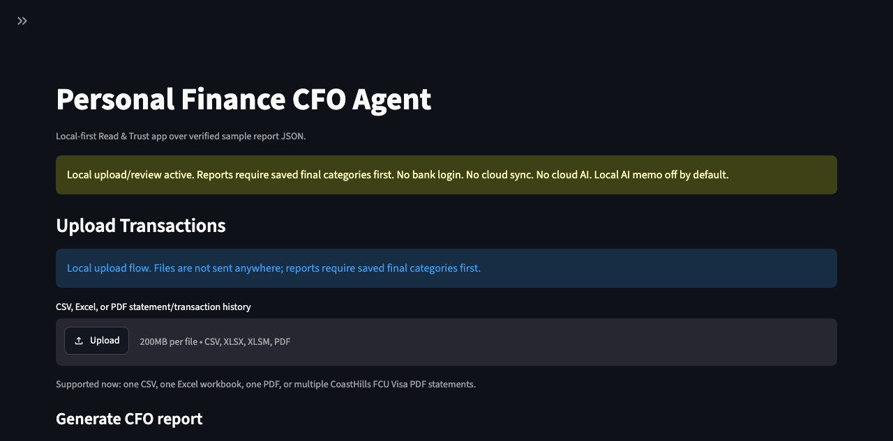
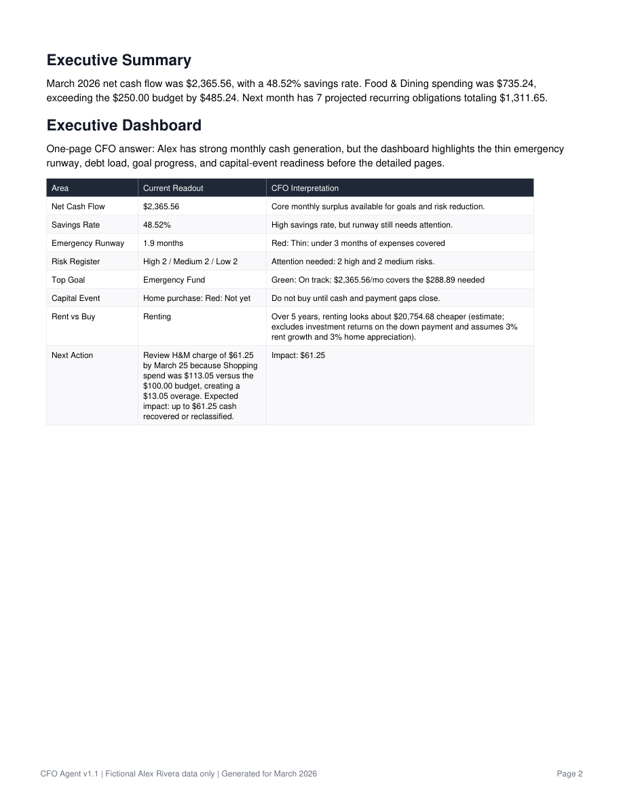
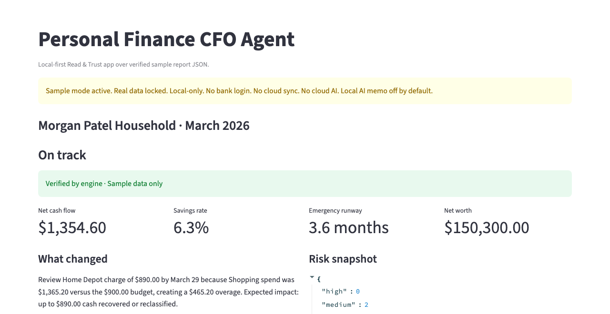
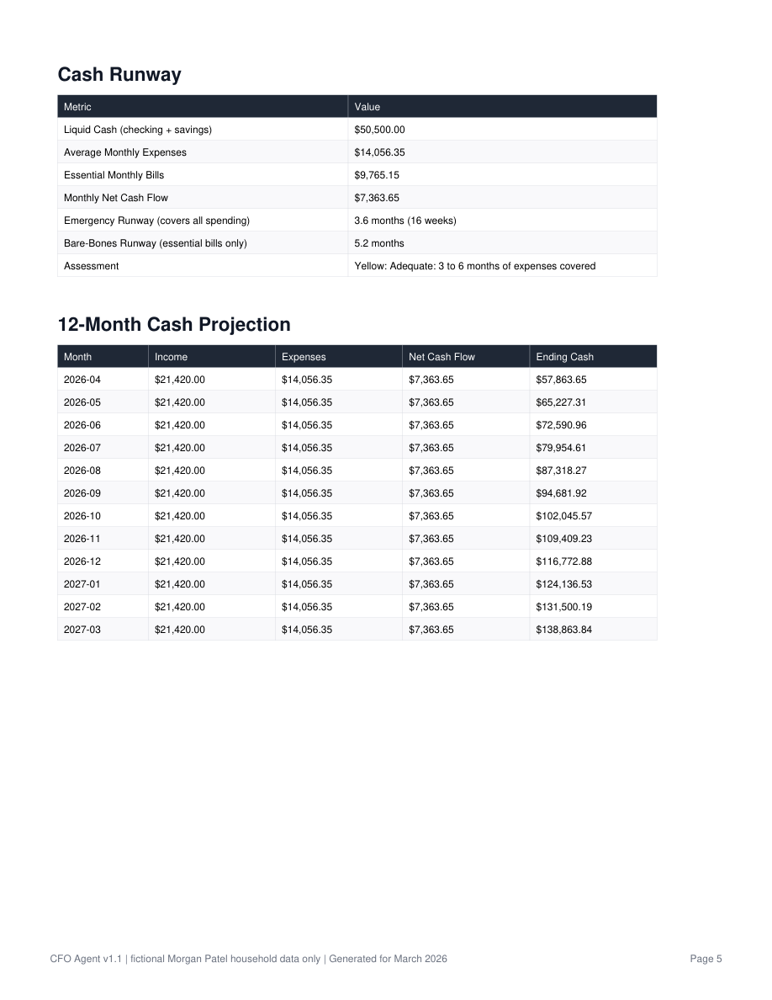
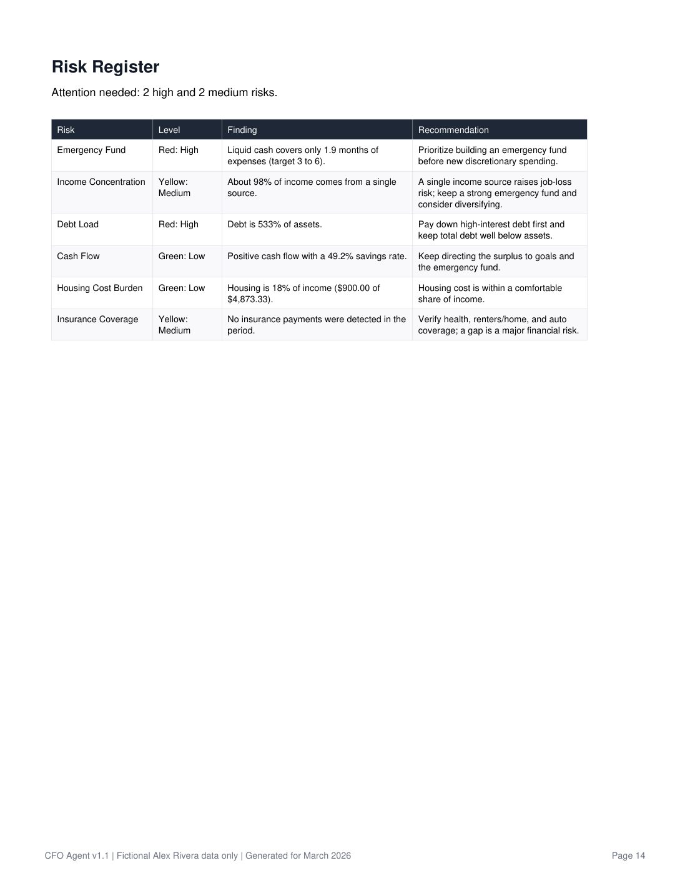
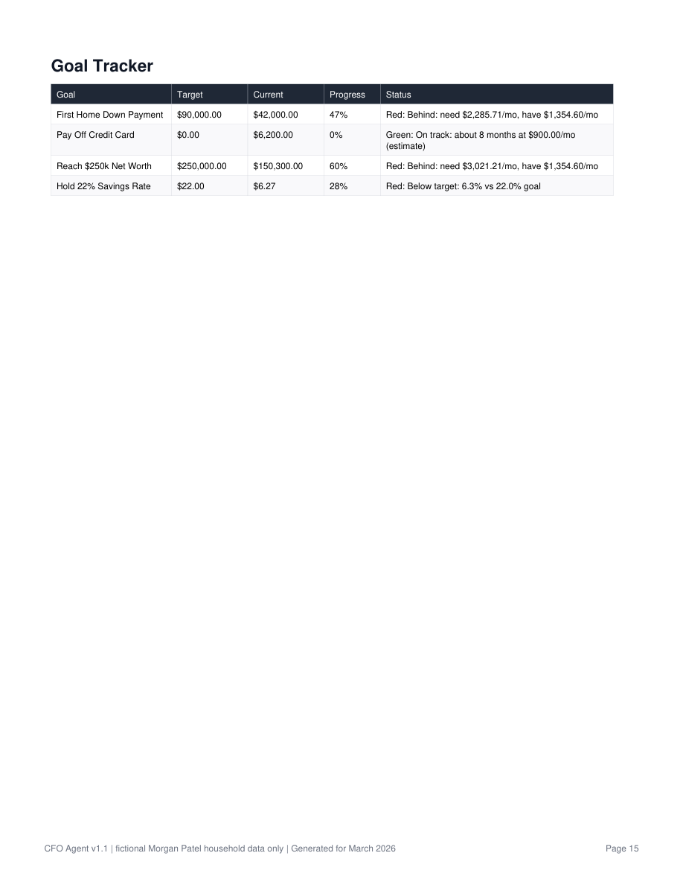
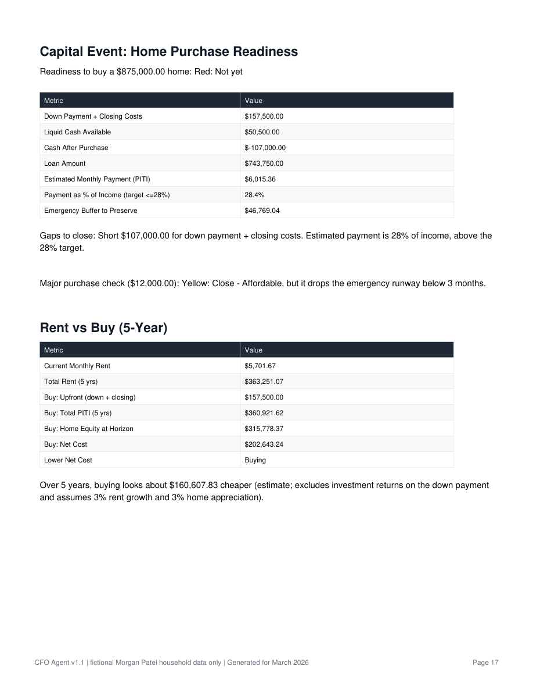
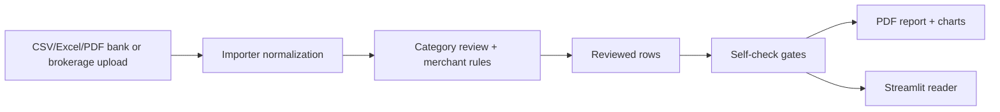

# Personal Finance CFO Agent


A local-first portfolio prototype that turns fictional samples or user-approved local statement uploads into a family-office-style monthly CFO packet.

> **Local-first:** this project does not connect to bank accounts, does not use cloud AI, and is not financial advice. Portfolio screenshots and committed artifacts stay fictional/sample-only. Real uploads stay local in Git-ignored folders.

For a deeper visual walkthrough with sample report screenshots, see the
[Portfolio Summary](docs/PORTFOLIO_SUMMARY.md).

The local app/interface design direction and the engine's UI data contract are
documented in [Design Direction](docs/DESIGN_DIRECTION.md) and
[Report JSON Contract](docs/REPORT_JSON_CONTRACT.md).

## Why this is different

Most finance demos stop at spending charts. This project adds CFO-style variance explanations, runway and forecast checks, goals, risk, capital-event readiness, reviewed local uploads, and fail-closed self-checks before report generation.

## Feature snapshot

- Local CSV/Excel/PDF upload, including brokerage activity exports, with no bank login, cloud sync, or cloud AI.
- Editable category review before any uploaded rows become report-ready.
- Merchant-rule bulk fill for repeat vendors.
- Deterministic self-checks for schema, categories, duplicates, and math reconciliation.
- PDF reports, charts, stress tests, and Streamlit reader screens from the same checked engine.
- Local Progress Memory saves report-to-report history under Git-ignored `outputs/personal/`.

## Preview

### Local Upload + Category Review



### One-page Executive Dashboard



### Local Read & Trust App



### CFO Report Highlights

| Cash Runway | Risk Register |
|---|---|
|  |  |

| Goal Tracker | Capital Event Readiness |
|---|---|
|  |  |

The README screenshots use the richer fictional complex-household fixture so the portfolio preview shows dual income, mortgage-level housing, childcare, debt payoff, savings transfers, home-buying goals, and surprise expenses. No real financial data is shown.

## What This Project Does

The Personal Finance CFO Agent turns fictional transaction data into a family office-style monthly reporting packet. It analyzes cash flow, spending categories, budget variance, recurring vendors, fixed obligations, unusual expenses, forecasts, net worth, debt payoff options, stress scenarios, risk flags, goals, capital-event readiness, rent-vs-buy tradeoffs, and prioritized action items. This is not a budgeting app; it is a CFO/FP&A reporting system designed to explain what happened, why it matters, what comes next, and what action the fictional sample persona should take.

Current verification status:

```text
246 local tests passing
GitHub Actions passing
100-persona fictional stress harness available
Local CSV/Excel bank and brokerage upload, CoastHills Visa PDF upload, multi-PDF merge, category review, and gated personal report generation verified
```

## What It Produces

Each committed test persona under `test_personas/` includes a full local run:

- source `transactions.csv`
- categorized `transactions_categorized.csv`
- verified `outputs/report.json`
- `outputs/monthly_cfo_report.pdf`
- report charts under `outputs/charts/`
- starter fixture only: `outputs/three_month_trend_summary.pdf`

Private uploaded-statement reports still generate under Git-ignored local folders after categories are reviewed and saved.

Selected screenshots are committed under `docs/screenshots/` for GitHub display.

## How It Works



## How To Run It

Beginner-friendly setup with a local virtual environment:

```bash
git clone https://github.com/Pmadge/personal-finance-cfo-agent.git
cd personal-finance-cfo-agent
python3 -m venv .venv
source .venv/bin/activate
python3 -m pip install -r requirements.txt
python3 -m py_compile main.py modules/*.py modules/reports/*.py modules/importers/*.py modules/ui/*.py scripts/*.py streamlit_app.py
python3 -m pytest -q
python3 main.py
python3 scripts/generate_monthly_report.py
python3 scripts/generate_trend_report.py
python3 scripts/monthly_close.py --sample
python3 scripts/generate_personal_report.py
```

To regenerate the richer GitHub README screenshots from the fictional complex-household fixture:

```bash
python3 scripts/generate_complex_household_screenshots.py
```

To regenerate the UI report JSON contract (what the local Read & Trust app binds to):

```bash
python3 scripts/generate_report_json.py
```

### Local Read & Trust app

The local Streamlit app starts with a blank first-run setup when `config/personal_profile.json` does not exist. It does not show sample numbers on first boot. Fictional numbers live under Example Reports, where you can choose a committed test persona. Uploads never leave the machine. Supported upload paths now include:

- one personal-template CSV or Excel workbook
- one Debit/Credit CSV export
- one Debit/Credit Excel workbook
- one brokerage activity CSV or Excel export with date, amount, and action/description/symbol columns
- one CoastHills FCU Visa statement PDF
- multiple CoastHills FCU Visa statement PDFs merged into one review file

The upload flow is: upload → preview normalized rows → apply merchant rules if useful → edit final categories → save local review CSV → generate a gated local CFO report.

```bash
python3 -m pip install -r requirements.txt
python3 scripts/generate_report_json.py
python3 scripts/monthly_close.py --sample
python3 scripts/stress_test_personas.py --count 12 --seed 20260628 --output-dir outputs/stress_tests/review_smoke_12_personas
streamlit run streamlit_app.py
```

Current screens:

1. First Run Setup — local baseline questions for goals, current balances, debt, and future planning.
2. Home Dashboard — empty personal state until a local report exists.
3. Upload Transactions — local CSV/Excel/PDF bank or brokerage upload, category review editing, merchant-rule bulk fill, and gated report generation.
4. Monthly Report — empty personal state until a local report exists.
5. Category Review — empty personal state until a local upload review exists.
6. Example Reports — choose a fictional test persona and inspect sample dashboard/monthly report numbers.
7. Progress Memory — read-only local report history and report-to-report deltas.
8. Stress Test Explorer — read-only Workbench grid over generated fictional stress-test results.
9. Local AI Memo — disabled placeholder only; no AI call, no cloud fallback, no generated memo.
10. Settings / Privacy — sample/local-only trust settings and self-check status.

### Personalize the report (optional)

The personal report's pillar sections (cash runway, goals, scenarios, risk
register, home-purchase readiness) read a financial profile of assets,
liabilities, goals, what-if scenarios, and a home target. On first boot, the
Streamlit app asks for a local baseline and saves `config/personal_profile.json`.
You can also set up your own local profile from the terminal:

```bash
python3 scripts/setup_personal.py
```

This creates a local `config/personal_profile.json` (from the example), confirms
your private files are Git-ignored, and prints the next commands. Edit it with
your numbers, or use the First Run Setup screen in the app.

`config/personal_profile.json` is Git-ignored and stays local. If it is absent,
the app starts blank instead of showing sample numbers. Real transaction files are handled only through explicit local upload/review paths and Git-ignored folders.

### Robustness stress test

To stress test the engine end to end across many fictional people with different
wealth levels, incomes, careers, life stages, goals, and spending habits, run:

```bash
python3 scripts/stress_test_personas.py
```

By default this generates 100 fictional personas and writes inspectable results
to `outputs/stress_tests/run_<timestamp>_100_personas/`. To reproduce the current
100-person run exactly, use:

```bash
python3 scripts/stress_test_personas.py --count 100 --seed 20260627 --output-dir outputs/stress_tests/run_100_personas_seed_20260627
```

Each run writes `summary.csv`, `summary.json`, a `README.md`, and one folder per
persona with `input_transactions.csv`, `categorized_transactions.csv`,
`profile.json`, `step_results.json`, `report_summary.md`, `full_report.md`, and detailed analysis
tables. The stress-test outputs are generated/local-only and ignored by Git.
Fictional data only.

The sample CSV is already included at:

```text
test_personas/starter_person/transactions.csv
```

To use a different fictional dataset, replace that file with a CSV using the same schema below.

## Privacy-First Product Direction

Long term, this project should become a local-first personal CFO product that can run fully on Paul's Mac as either a script workflow or a small local app. The default design should not require cloud hosting, external AI APIs, hosted databases, or bank-login integrations.

Personal financial data should stay local. The repository and portfolio screenshots stay fictional/sample-only, while the local app can process explicitly provided CSV/Excel/PDF statement uploads into Git-ignored local folders.

Important local-data rule: real transaction CSVs, PDF statements, processed personal files, local vendor rules, and personal reports belong only in Git-ignored local folders such as `data/personal/`, `data/processed/`, and `outputs/personal/`. Do not use real financial data in portfolio screenshots or committed sample artifacts.

Roadmap: `docs/LOCAL_FIRST_PERSONAL_USE_ROADMAP.md`
Backend/data foundation: `docs/BACKEND_DATA_FOUNDATION.md`

## Local AI Agent Workflow

Project-scoped instructions are included for repeatable local development across AI coding tools:

```text
AGENTS.md
CLAUDE.md
```

These keep future coding sessions aligned on local-first privacy rules, simple changes, and verified deterministic outputs. Tool-specific folders and generated graph files are ignored because they can contain machine-specific hooks, caches, or private local context.

Important: do not run graph tools or AI workflows on real personal financial data, credential files, bank exports, or private report outputs.

## Project Structure

```text
test_personas/           # Reusable fictional personas with full run outputs
main.py                 # Runs the core analysis pipeline and prints CFO outputs
modules/                # Reusable analysis, forecasting, chart, and report logic
modules/importers/      # Local CSV import and normalization helpers
modules/reports/        # Source code for PDF report builders
data/                   # Local workflow folders plus safe templates
outputs/                # Git-ignored review renders and private/local generated outputs
scripts/                # Beginner-friendly commands for generating reports/imports
requirements.txt        # Python packages needed for setup and testing
```

## Input Format

The input file must be a CSV with exactly these columns:

| Column | Expected Format | Example |
|---|---|---|
| `date` | `YYYY-MM-DD` | `2026-03-01` |
| `vendor` | Text merchant or income source | `Parkside Rent Portal` |
| `amount` | Number; income is positive, expenses are negative | `2400.00` or `-72.18` |
| `raw_category` | Text source category | `rent`, `dining`, `subscription` |

## Personal CSV Import Template

A fake personal-style import template is included at:

```text
data/sample/personal_transactions_template.csv
```

It uses these columns:

| Column | Meaning |
|---|---|
| `posted_date` | Bank/export posted date in `YYYY-MM-DD` format |
| `description` | Merchant, income source, or transaction description |
| `amount` | Positive for income, negative for expenses |
| `source_category` | Original category from the export or manual label |
| `source_account` | Optional account label, kept for review but not used in the internal schema yet |
| `notes` | Optional review notes |
| `transaction_id` | Optional bank/export transaction ID for traceability |

Run the local safety gate before any future real-data work:

```bash
python3 scripts/check_personal_mode_safety.py
```

This command verifies with Git itself that private local paths such as `data/personal/`, `data/processed/`, `outputs/personal/`, and `config/personal_rules.csv` are ignored. It does not upload files, call banks, or send data anywhere.

Run the full safe fake personal workflow with one command:

```bash
python3 scripts/monthly_close.py --sample
```

That command normalizes fake personal-style transactions, generates the category review, ensures the local Git-ignored override template exists, applies overrides, and writes the workflow audit receipt with the source input file SHA-256 hash. `--sample` only accepts input files under `data/sample/`; intermediate workflow CSVs stay under `data/processed/`; private report outputs stay under `outputs/personal/`. After reviewing the audit, run `python3 scripts/generate_personal_report.py` to create the draft fake personal report at `outputs/personal/personal_cfo_report_draft.pdf`. The Streamlit Upload Transactions screen handles explicitly selected local CSV/PDF uploads through the newer preview → review → save → report flow. The report script runs deterministic pre-render self-checks before writing any PDF or chart artifacts, including duplicate checks for source transaction IDs, imported source rows, and exact final-statement rows.

You can also run each step manually:

```bash
python3 scripts/import_personal_csv.py
python3 scripts/import_personal_csv.py --profile fake-bank --output data/processed/fake_bank_profile_normalized.csv
python3 scripts/generate_category_review.py
python3 scripts/apply_category_overrides.py --create-template
python3 scripts/apply_category_overrides.py
python3 scripts/generate_workflow_audit.py
python3 scripts/generate_personal_report.py
```

The one-command workflow runs the safe fake personal close from import through audit. The manual commands do the same work step by step: normalize fake personal-style transactions, optionally normalize the fake bank-export profile fixture, generate a category review CSV that preserves source identity fields and marks low-confidence rows for manual review, ensure a local Git-ignored override template exists at `config/personal_rules.csv`, apply corrections into `data/processed/category_review_applied.csv`, write local workflow receipts to `data/processed/workflow_audit.md` and `data/processed/workflow_audit.json`, and generate a draft fake personal report PDF under `outputs/personal/`. By default, the audit uses `self_check_status=NOT_RUN`; only pass `--self-check-status PASS` after a real self-check has run.

The normalized output includes source identity columns so each row can be traced back to the import file:

| Column | Meaning |
|---|---|
| `source_file` | Source file basename that produced the normalized row. The importer intentionally stores only the file name, not the full local path. |
| `source_row_number` | Original CSV row number, counting the header as row 1 |
| `import_batch_id` | Short deterministic ID based on the source file contents |
| `transaction_id` | Optional source transaction ID when the export provides one |

Keep real transaction files only in Git-ignored local paths such as `data/personal/`, `data/processed/`, and `outputs/personal/`.

## Sample Persona

The starter-person fixture is a fictional young professional with bi-weekly paycheck income, rent, groceries, dining, transportation, subscriptions, student loan payments, and occasional unusual charges. Fictional data is used so the project can demonstrate financial reporting logic without exposing real personal bank, credit card, or identity information. No real personal financial data should be added to this project.

## Key Calculations

- Savings rate: `(Income - Total Expenses) / Income x 100`
- Budget variance: `Budget Amount - Actual Amount`
- Unusual expense threshold: a transaction above `2x` category average and above the category minimum review threshold
- Fixed obligations: recurring rent, phone, gym, streaming subscriptions, and student loan payments only
- Forecast scenarios: 30-day and 90-day upside/base/downside cash-flow estimates from 3-month history

## FP&A Concepts Demonstrated

- Budget vs. actual variance analysis with root cause, forward impact, and recommended action.
- Rolling forecast scenarios for expected cash flow, savings rate, and ending cash.
- Separation of fixed obligations from discretionary recurring behavior.
- Action-item prioritization with owner, due date, status, urgency, and estimated dollar impact.
- Audit trail checks for row count, month coverage, schema validation, and fictional data labeling.

## Model Assumptions

- Report month is March 2026.
- The source dataset covers January-March 2026.
- The starter-person monthly budget is fixed for this demo.
- Forecasts use the available 3-month history and are directional estimates, not financial advice.
- Net worth uses fictional sample balances: checking, savings, investments, student loan, car loan, and credit card.

## Limitations

- This project does not provide investment advice.
- This project does not calculate taxes.
- This project does not connect to live bank accounts, brokerage accounts, or real-time financial data.
- This project does not replace a regulated financial planning, accounting, or compliance system.
- The forecast is based on only 3 months of fictional history, so it should be read as a portfolio modeling example.

## Portfolio Context

This project demonstrates how raw transaction data can be transformed into a family office-style reporting packet with categorized cash flow, risk flags, charts, narrative commentary, forecast scenarios, and specific action items. It shows practical wealth management and FP&A reporting skills: data quality control, variance analysis, financial modeling, executive communication, and client-ready PDF production.
