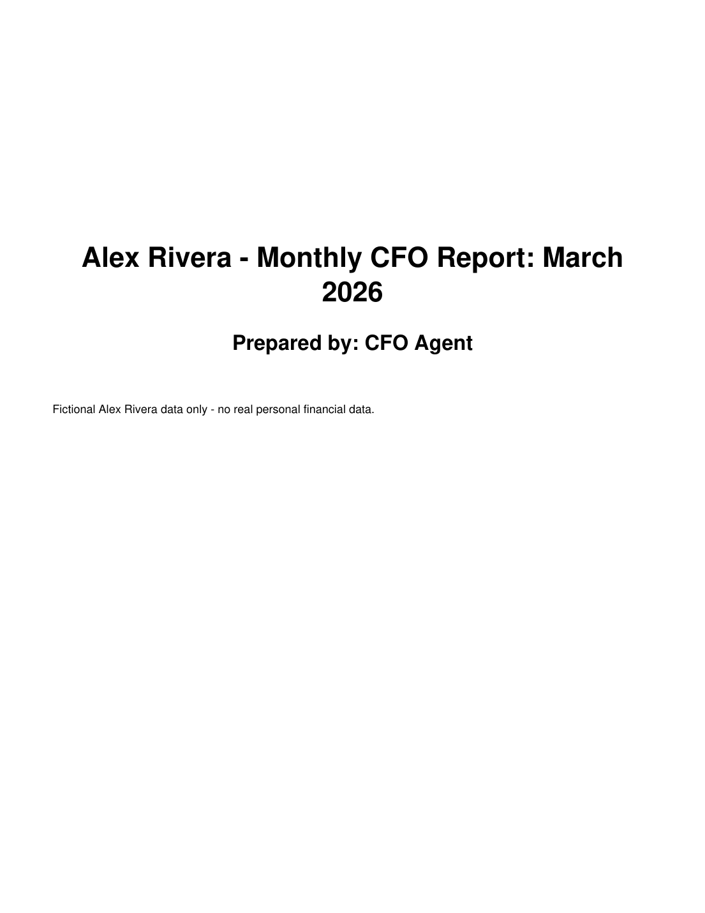
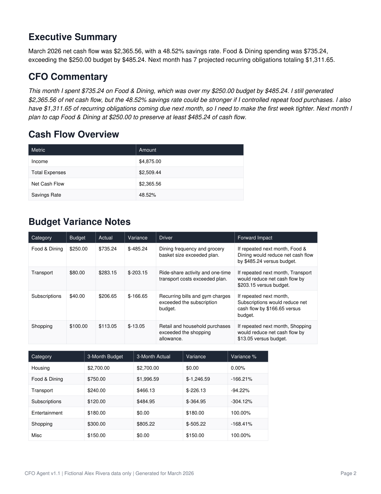
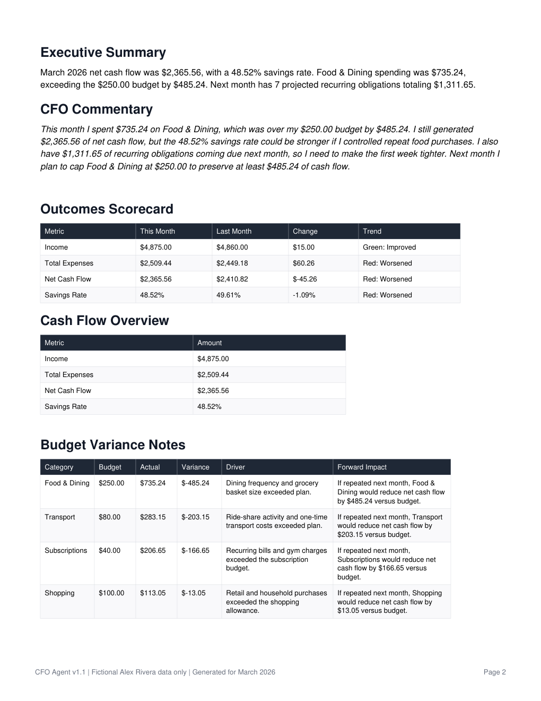
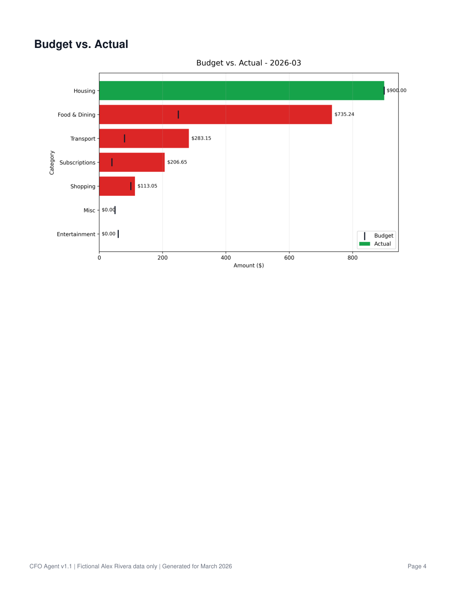
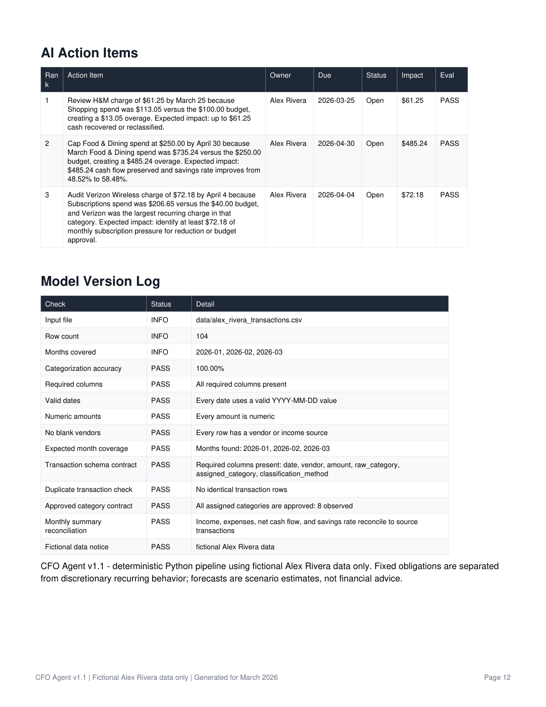
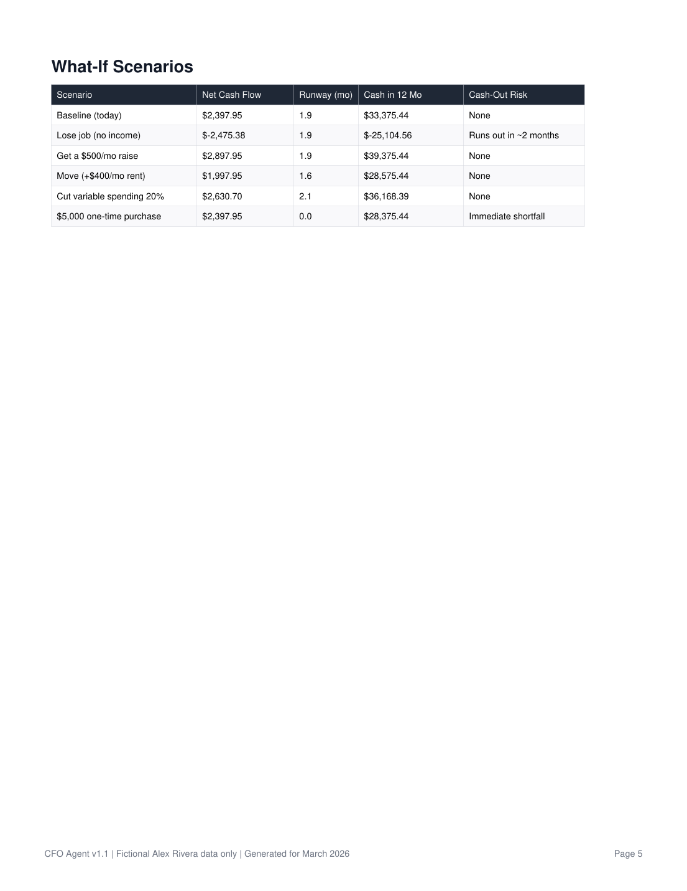
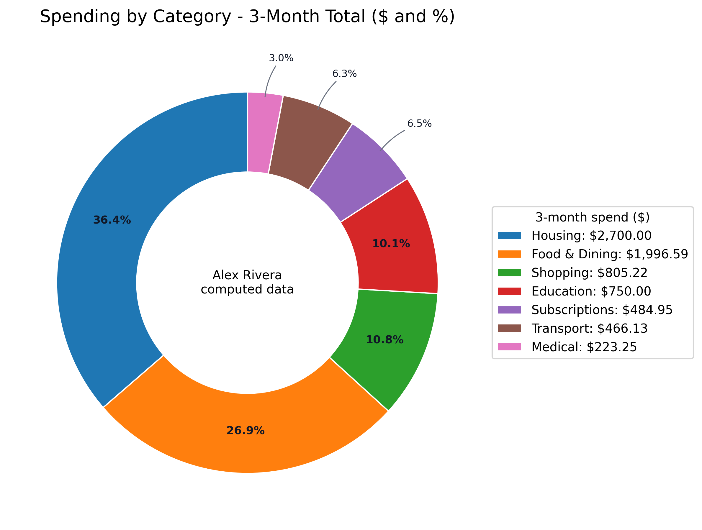
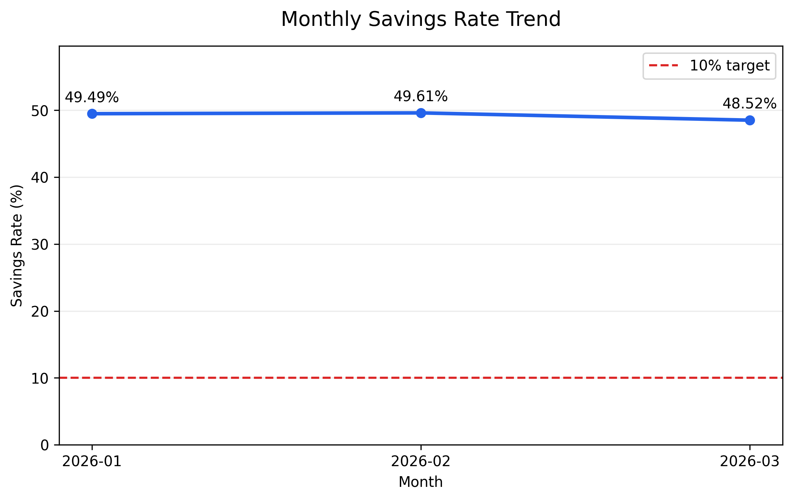
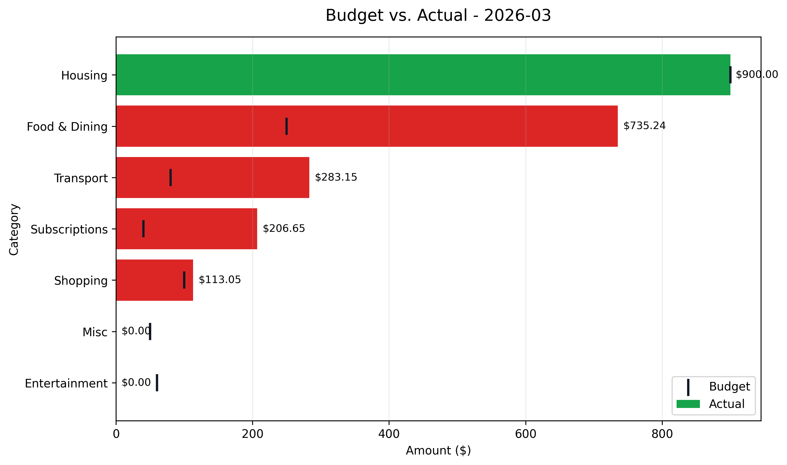
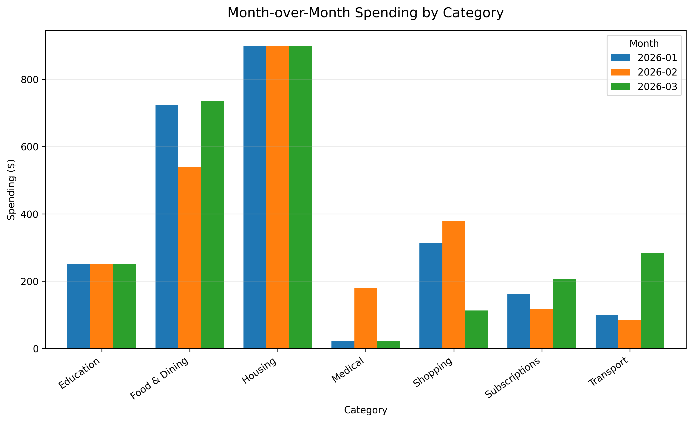

# Personal Finance CFO Agent Portfolio Summary

A local-first Python system that turns fictional transaction data into a family office-style monthly CFO reporting packet: categorized cash flow, budget variance analysis, cash runway, scenarios, goals, risk register, capital-event readiness, rent-vs-buy analysis, charts, and prioritized action items.

It is not a budgeting app. It is an FP&A reporting system designed to explain what happened, why it matters, what comes next, and what action to take.

All examples and committed screenshots use fully fictional sample personas. Public fixture paths are generic: `test_personas/starter_person/` for the simple board pack and `test_personas/complex_household/` for the richer GitHub/portfolio screenshots. The local app can now process explicitly provided local statement uploads, but no real financial data is committed or shown in portfolio assets.

## Current status

```text
Repository: private GitHub repo
CI: GitHub Actions passing
Local tests: 245 passing
Data posture: committed assets fictional/sample only
Local real uploads: CSV, Excel, brokerage activity exports, and CoastHills Visa PDF statements supported in Git-ignored folders
```

The project now has the full v1 CFO parity suite wired into both the fictional starter-person board pack and the draft personal report path.

## What it produces

A run generates:

- a comprehensive monthly CFO report PDF
- a 3-month trend summary PDF
- analysis charts
- a sample-only monthly close workflow receipt
- a draft personal report from reviewed fake personal rows or explicitly uploaded local CSV/Excel/PDF bank or brokerage statements
- stress-test outputs for fictional personas

Committed test-persona outputs now live under `test_personas/<persona>/outputs/` so GitHub visitors can inspect a full run without generating files locally. Portfolio screenshots live under `docs/screenshots/` so GitHub renders the walkthrough immediately. Selected report screenshots are regenerated from `test_personas/complex_household/transactions.csv` with `scripts/generate_complex_household_screenshots.py`; the Streamlit screenshot is captured from the local Read & Trust app.

## Representative report pages

### Local Read & Trust app

The Streamlit app renders the verified report JSON, category review CSV, and fictional stress-test summaries without recalculating numbers or calling AI.


### Cover and executive summary





### Executive dashboard

The first content page now consolidates the board pack into a one-page CFO readout: net cash flow, savings rate, emergency runway, risk count, top goal, capital-event readiness, rent-vs-buy answer, and next action. The screenshot below uses the richer fictional complex-household fixture, not real data.


### Outcomes scorecard

This month vs last month on the metrics that matter: income, expenses, net cash flow, and savings rate.



### Budget variance and prioritized action items





### Cash runway and 12-month projection

How long liquid cash would last if income stopped, plus a month-by-month ending-cash trajectory.


### What-if scenarios

Side-by-side impact of life changes like job loss, a raise, moving costs, discretionary cuts, or a one-time purchase.



### Goal tracker

Progress toward savings, debt payoff, net worth, and savings-rate goals.


### Risk register

A personal risk register rating emergency fund, income concentration, debt load, cash flow, housing burden, and insurance coverage.


### Capital-event playbook

Home-purchase readiness, major-purchase affordability, and rent-vs-buy comparison.


## Analysis charts

| | |
|---|---|
|  |  |
|  |  |

## CFO parity features

The v1 engine now covers seven CFO-style pillars:

1. **Categorization generalization**: transparent merchant/category logic that keeps unknowns reviewable instead of silently hiding them.
2. **Goals tracker**: savings, debt payoff, net worth, and savings-rate goals with progress and on-track status.
3. **Forecasting depth**: emergency runway, bare-bones runway, 12-month cash projection, and scenario estimates.
4. **What-if scenarios**: job loss, raise, move, discretionary cut, and large-purchase style scenarios.
5. **Risk register**: six personal risk categories with level, finding, and recommendation.
6. **Capital-event playbooks**: home-purchase readiness, major-purchase check, and rent-vs-buy analysis.
7. **Service wrapper**: outcomes scorecard and defined CFO engagement scope/cadence.

## Data quality and trustworthiness

The system is built to fail closed before it reports numbers it cannot defend:

- schema and category contracts verify report-ready data
- monthly income, expenses, net cash flow, and savings rate reconcile back to source rows
- duplicate source transaction IDs, source rows, and exact final-statement rows are checked before personal reports render
- source-file SHA-256 hashes are captured in workflow audit artifacts
- generated private paths stay under Git-ignored local folders
- stress tests exercise many fictional personas and assert value invariants, not just crash-free execution

The deterministic Python engine owns the numbers. Any future local AI layer should explain checked outputs, not invent financial results.

## Local-first privacy design

- No bank-login integrations.
- No external AI APIs.
- No hosted database.
- No real financial data in the repo.
- Private folders such as `data/personal/`, `data/processed/`, `outputs/personal/`, and local profile/rules files are Git-ignored.
- The one-command setup creates a local `config/personal_profile.json` and verifies private paths are ignored by Git.

## How to run and regenerate

```bash
git clone https://github.com/Pmadge/personal-finance-cfo-agent.git
cd personal-finance-cfo-agent
python3 -m venv .venv
source .venv/bin/activate
python3 -m pip install -r requirements.txt
python3 -m pytest -q
python3 main.py
python3 scripts/generate_monthly_report.py
python3 scripts/generate_trend_report.py
python3 scripts/monthly_close.py --sample
python3 scripts/generate_personal_report.py
```

Optional local profile setup:

```bash
python3 scripts/setup_personal.py
```

The Streamlit first-run setup starts blank and saves `config/personal_profile.json` locally. The local file is ignored by Git. Committed portfolio assets remain fake/sample-only under Example Reports; manually selected CSV/Excel/PDF bank or brokerage uploads are processed only in Git-ignored local folders.

## Tech stack

Python, pandas, matplotlib, reportlab, PyMuPDF, Streamlit, pytest, GitHub Actions.

## Limitations

- Not investment, tax, accounting, legal, or compliance advice.
- Does not connect to live accounts or real-time data.
- Manual local CSV/Excel/PDF bank or brokerage uploads are supported, but private outputs stay Git-ignored and are not portfolio artifacts.
- Forecasts and rent-vs-buy outputs are directional estimates, not decisions.
- The board pack is intentionally comprehensive. The new Executive Dashboard gives readers the one-page answer first, while the detailed sections remain available for auditability.

## Next planned step

Progress Memory now saves local report history and report-to-report deltas. Keep the repo private until an outside-viewer readiness pass is clean.
